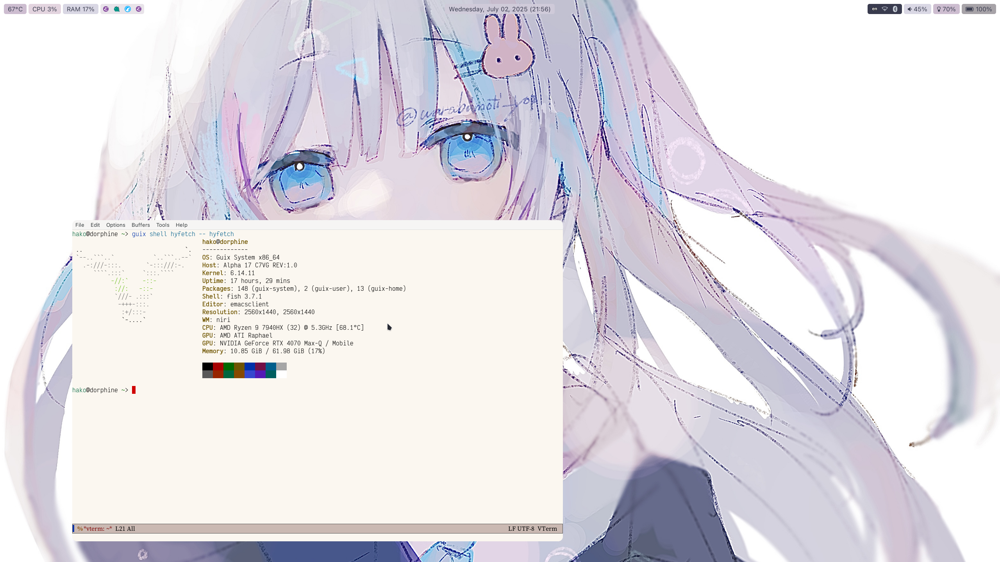
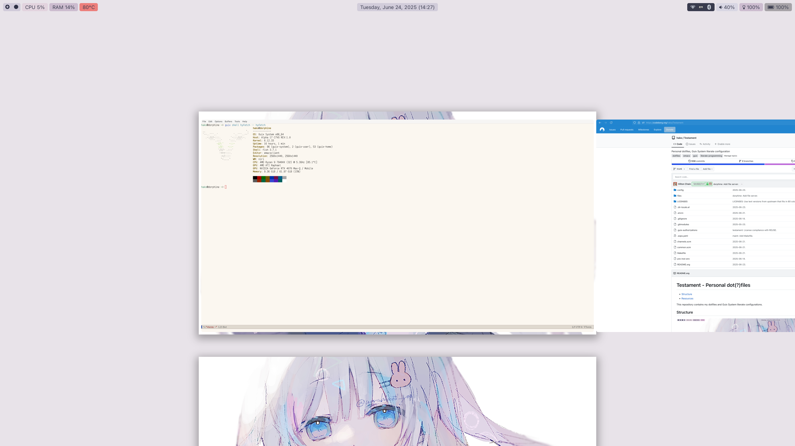
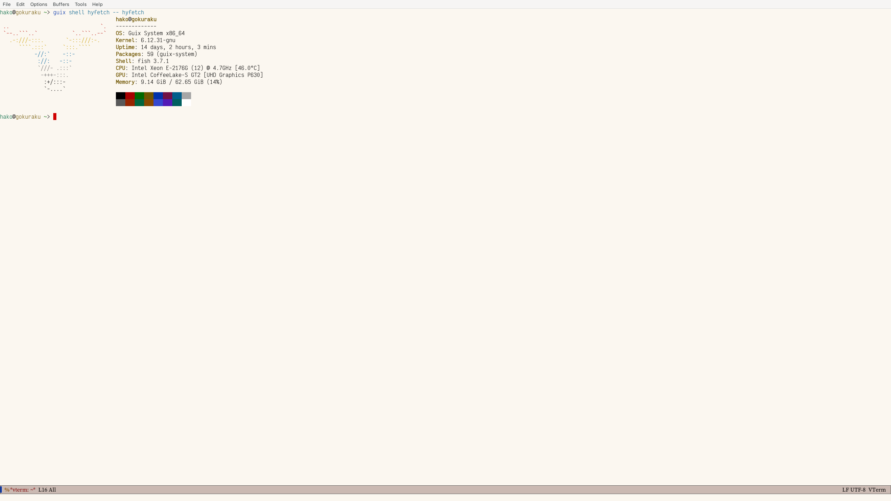
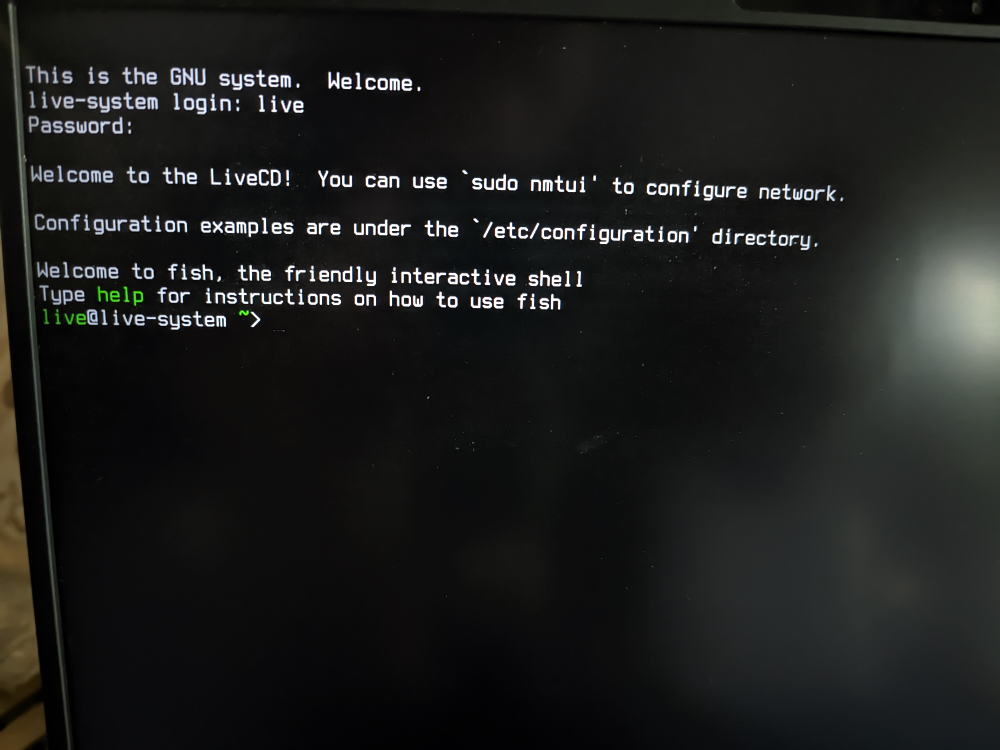
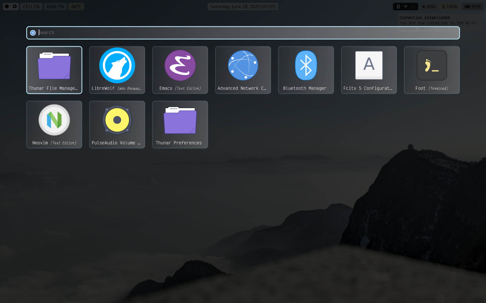

# SPDX-FileCopyrightText: 2023, 2024, 2025 Hilton Chain <hako@ultrarare.space>
# SPDX-License-Identifier: CC0-1.0

#+TITLE: Testament - Personal dot(?)files

This repository contains my dotfiles and Guix System literate configurations.

* Structure
+ [[file:config][config]] :: Guix System configurations.
+ [[file:files/deploy][files/deploy]] :: Configurations for ~guix deploy~.
+ [[file:files/dotfiles][files/dotfiles]] :: Dotfiles for =home-dotfiles-service-type=.
+ [[file:files/plain][files/plain]] :: Files to be referenced in configurations.
+ [[file:files/blobs][files/blobs]] :: Likewise but private.

See [[file:Makefile][Makefile]] for usage.

Guix channels in use:
+ [[https://codeberg.org/guix/guix.git][guix]]
+ [[https://gitlab.com/nonguix/nonguix][nonguix]]
+ [[https://codeberg.org/hako/rosenthal.git][rosenthal]]
+ [[https://github.com/fishinthecalculator/sops-guix][sops-guix]]

* Systems
** [[file:config/dorphine.org][dorphine]] (x86_64-linux, laptop)

** [[file:config/gokuraku.org][gokuraku]] (x86_64-linux, server)

* LiveCDs
I'm providing two LiveCDs for the [[https://guix.gnu.org/manual/devel/en/html_node/Manual-Installation.html][manual installation]] of Guix System.  Pre-built
images are available for x86_64-linux: https://files.boiledscript.com/livecd/

These LiveCDs use [[https://fishshell.com/][fish]] as the login shell, they also include the =cow-store= and
=NetworkManager= services.

Guix System configuration examples are available [[file:files/plain/live/examples][in this repository]], they are
also added to the LiveCDs under the =/etc/configuration= directory.  Most of the
examples are based on the templates included in Guix source tree.

Two external channels, [[https://gitlab.com/nonguix/nonguix][Nonguix]] and [[https://codeberg.org/hako/rosenthal.git][Rosenthal]], are configured via the
transformation interfaces (TODO documentation), so you can add and remove these
channels from the configurations easily.

Examples created by me (with a =rosenthal-= prefix in file names) are replicated
from the LiveCD(s) and they have hard dependency on the Rosenthal channel.
Since Rosenthal is still unstable, they are considered experimental.

** [[file:config/live-console.org][console]]
Username: =live=, password: =rosenthal=

This LiveCD starts a SSH daemon listening on port =20202=.  For network
configuration, =NetworkManager= is available (~sudo nmtui~, ~sudo~ is required
because Polkit is not configured).

** [[file:config/live-desktop.org][desktop]]
Username: =live=, no password.

This live system provides a pre-configured Emacs and a desktop environment built
around the [[https://github.com/YaLTeR/niri][niri compositor]].  Their configurations are managed [[https://codeberg.org/hako/Rosenthal/src/branch/trunk/modules/rosenthal/examples][in the Rosenthal
channel]].

Default keybindings:
+ =Super + Shift + /= :: Open an overlay for available hotkeys.
+ =Super + T= :: Open terminal emulator, [[https://codeberg.org/dnkl/foot][foot]] is used.
+ =Super + D= :: Open application launcher, [[https://github.com/lbonn/rofi][rofi-wayland]] is used.

To change keyboard layout, edit niri configuration at
=~/.config/niri/config.kdl= (see [[https://github.com/YaLTeR/niri/wiki/Configuration:-Input#keyboard][its documentation for keyboard layout]]).
Changes to the configuration file will be applied immediately.

#+begin_src shell
  # Open terminal emulator (Super + T)

  # Make the configuration file writable.
  $ cd ~/.config/niri
  $ chmod +w config.kdl

  # Edit the configuration using editor of your choice.
  $ nano config.kdl
  $ nvim config.kdl
  $ emacs config.kdl
#+end_src

* Resources
+ [[https://files.spritely.institute/papers/scheme-primer.html][A Scheme Primer]] :: Nice short guide to get you started with Scheme.
+ [[https://guix.gnu.org/manual/devel/en/guix.html][GNU Guix Reference Manual]] (~info guix~) :: See [[https://guix.gnu.org/manual/devel/en/html_node/Getting-Started.html][Getting Started]] if you want an
  entry point.
+ [[https://guix.gnu.org/cookbook/en/guix-cookbook.html][GNU Guix Cookbook]] (~info guix-cookbook~) :: Tutorials and detailed examples.
  Some entries may be outdated, contribution is welcome ;)
+ [[https://guix.gnu.org/en/contact/][Contact — GNU Guix]] :: Official communication channels.
+ [[https://packages.guix.gnu.org/][Packages — GNU Guix]] :: Official package index, =guix= channel only (see
  [[https://guix.gnu.org/manual/devel/en/html_node/Channels.html][Channels]] in Guix manual).
+ [[https://toys.whereis.social/][Toys / Webring for GNU Guix channels]] :: Unofficial package index, including
  most known Guix channels.
